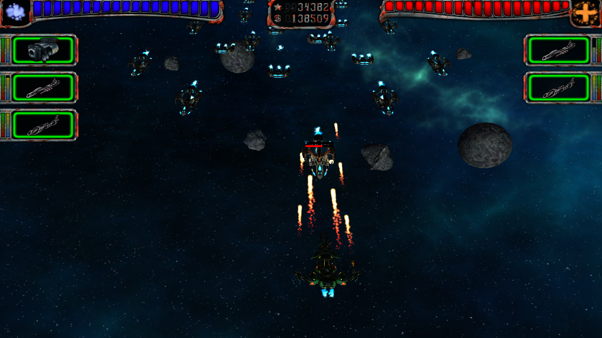
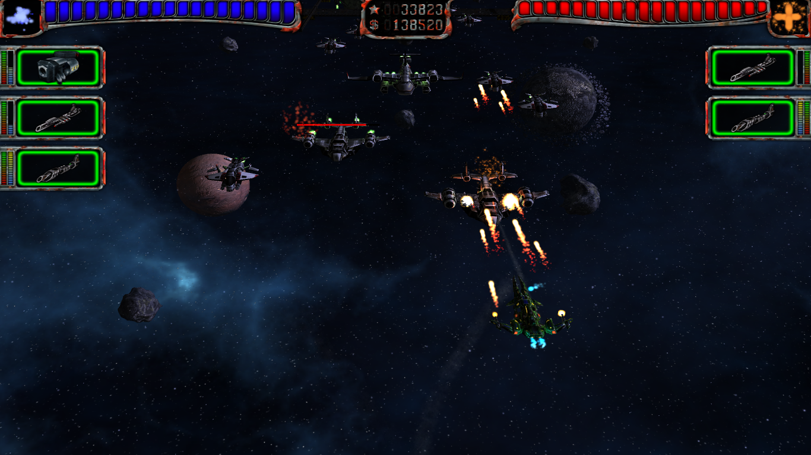
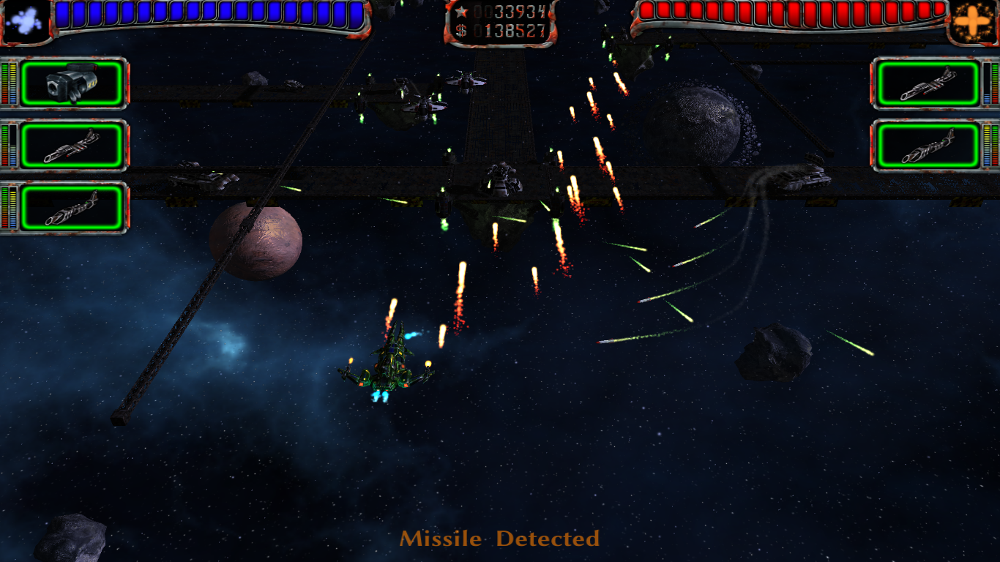

<div align="center">


# AstroMenace for Yandex Games

**A desktop-focused WebAssembly port of the open-source AstroMenace space shooter, adapted for Yandex Games.**

[](https://yandex.ru/games/)
[](https://webassembly.org/)
[](https://www.libsdl.org/)
[](#localization)

</div>

<p align="center">
  
</p>

> [!IMPORTANT]
> This is a **community WebAssembly/Yandex Games port**. AstroMenace itself was created by the **Viewizard** team. This repository does not claim ownership of the original game, name, artwork, music, models, or other upstream assets.

## ✨ About the port

AstroMenace is a classic 3D space scrolling shooter with ship upgrades, weapons, missions and large-scale space battles. This repository keeps the original gameplay while adapting the engine and runtime for modern browsers and the Yandex Games platform.

The current Yandex build is designed primarily for **desktop browsers** with keyboard and mouse controls.

### Current Yandex/Web features

- ⚙️ C++/SDL2 → **WebAssembly** via Emscripten
- 🎮 OpenGL compatibility through **gl4es → WebGL**
- 🖥️ desktop-oriented 1280×720 game surface with browser scaling
- 🟨 official **Yandex Games SDK** initialization
- ✅ `LoadingAPI.ready()` after the playable menu is ready
- 🎯 `GameplayAPI.start()` / `GameplayAPI.stop()` around actual gameplay and pauses
- 🌐 automatic language selection through `ysdk.environment.i18n.lang`
- 🇷🇺 Russian and 🇬🇧 English runtime localization
- ☁️ local + **Yandex Player cloud saves** with newest-save selection
- 🔁 duplicate cloud writes are skipped instead of spamming `player.setData()`
- 🖱️ Pointer Lock during missions so mouse control stays inside the game
- 🔇 audio pause/resume during ads, platform overlays and page focus changes
- 📺 fullscreen ads become eligible every **2 minutes** and are shown only at safe gameplay pauses
- 🚫 no browser-useless **Quit** button in the Yandex/Web main menu
- 🛡️ CSP-friendly shell with external scripts/styles and no custom inline handlers
- 📦 optimized RU/EN runtime package kept below the Yandex Games size target
- 💾 generated build can also be opened locally through `index.html` without a separate web server

## 🕹️ Gameplay

<p align="center">
  
  
</p>

AstroMenace includes missions, multiple player ships, weapon systems, upgrades, enemies and large 3D battle scenes. The browser port intentionally preserves the original game rather than reimplementing or redesigning its core gameplay.

## 🎮 Controls

The Yandex build currently targets **desktop** users.

| Action | Input |
|---|---|
| Ship movement / aiming | Mouse + configured keyboard controls |
| Primary / secondary weapons | Configurable in-game |
| Pause / menu | `Esc` |
| Mouse capture | Activated during gameplay; click the game area if the browser asks for interaction first |

Mobile/touch controls are **not** currently part of the supported Yandex target.

## 🌐 Localization

The web runtime intentionally ships only:

- **English**
- **Russian**

Inside Yandex Games the language is selected from `ysdk.environment.i18n.lang` during startup. Russian-family fallback locales used by this port map to Russian; unsupported locales fall back to English.

## ☁️ Saves

Progress is stored locally and synchronized through the Yandex Player API when available.

The synchronization layer:

1. loads local progress;
2. reads the cloud snapshot;
3. compares local/cloud timestamps and contents;
4. selects the newest valid progress;
5. skips cloud writes when nothing has changed;
6. flushes important progress after mission completion.

Local browser storage remains usable when the Yandex SDK or cloud player is unavailable.

## 📺 Advertising policy

Fullscreen advertising is never intentionally opened in the middle of active combat.

A two-minute cooldown makes an interstitial **eligible**. If the timer expires during gameplay, the request waits for a safe point such as a pause, menu transition or mission end. Yandex ultimately decides whether an individual fullscreen ad request is shown.

## 🏗️ Building

The current release-oriented workflow is:

```text
.github/workflows/build-web-offline.yml
```

Run **Build AstroMenace Fast Offline WebAssembly** from the repository's **Actions** page.

The workflow produces:

```text
astromenace-yandexgames-fast-offline
```

The artifact is a ready web root containing approximately:

```text
index.html
index.js        # engine + embedded WebAssembly
astromenace.css
gamedata.js     # compressed browser game data
LICENSE.md
AUTHORS.md
SOURCE_CODE.txt
licenses/
```

There is intentionally no separate `index.wasm` or `index.data` in the fast offline package.

### Build pipeline

```text
AstroMenace C++ / SDL2
        ↓
web-only source preparation
        ↓
Emscripten + gl4es
        ↓
WebAssembly embedded in index.js
        ↓
optimized RU/EN VFS → gzip → gamedata.js
        ↓
Yandex SDK / saves / ads / GameplayAPI bridge
        ↓
ready-to-upload web artifact
```

## 📁 Repository layout

```text
.github/workflows/   GitHub Actions WebAssembly builds
src/                 AstroMenace source tree
gamedata/            source game data
web/                 Yandex/browser shell and integration bridge
scripts/             build and asset optimization helpers
share/               screenshots, icons and upstream desktop metadata
docs/                port-specific documentation
licenses/             license texts
```

For implementation details, see **[docs/YANDEX_GAMES.md](./docs/YANDEX_GAMES.md)**.

## 🔧 Important port files

| File | Purpose |
|---|---|
| `web/yandex-offline-pre.js` | Yandex SDK, localization, cloud saves, ads, GameplayAPI, Pointer Lock, startup data installation |
| `web/offline-shell.html` | CSP-friendly browser shell |
| `web/astromenace.css` | browser layout and loading UI |
| `scripts/enable_gl4es_offline.py` | Web-only C++ preparation during CI |
| `scripts/rle_tga_assets.py` | lossless browser asset optimization |
| `.github/workflows/build-web-offline.yml` | reproducible release build |

## 🛰️ Upstream projects

This port builds on the work of several open-source projects:

- **AstroMenace** — [viewizard/astromenace](https://github.com/viewizard/astromenace)
- browser/Emscripten groundwork — [midzer/astromenace](https://github.com/midzer/astromenace)
- **gl4es** — [ptitSeb/gl4es](https://github.com/ptitSeb/gl4es)
- **Emscripten** — [emscripten-core/emscripten](https://github.com/emscripten-core/emscripten)
- **SDL** — [libsdl-org/SDL](https://github.com/libsdl-org/SDL)

## ⚖️ License & attribution

AstroMenace source code is distributed under **GNU GPL v3 or later**. The upstream game data contains material under multiple open-source/content licenses, including GPLv3, CC BY-SA 4.0 and SIL OFL 1.1 as documented by the original project.

Please read:

- [`LICENSE.md`](./LICENSE.md)
- [`NOTICE.md`](./NOTICE.md)
- [`AUTHORS.md`](./AUTHORS.md)
- [`licenses/`](./licenses/)

Generated web artifacts also contain source-code information and applicable license notices.

> Copyright notices belonging to Viewizard and the original contributors are intentionally preserved.

## 🙏 Credits

**Original AstroMenace:** Mikhail Kurinnoi / Viewizard and contributors.  
**Yandex Games / WebAssembly adaptation:** this repository and its contributors.

Full original credits remain available in the game and in [`AUTHORS.md`](./AUTHORS.md).

---

<details>
<summary><strong>🇷🇺 Кратко по-русски</strong></summary>

Это браузерный WebAssembly-порт оригинальной open-source игры **AstroMenace** для Яндекс.Игр. Сама игра создана командой **Viewizard**; этот репозиторий содержит именно адаптацию под браузер и SDK Яндекс.Игр.

В текущей версии есть RU/EN, автоматический выбор языка через SDK, облачные сохранения, GameplayAPI, захват курсора во время миссий, пауза звука при рекламе и полноэкранная реклама только в безопасных паузах. Целевая платформа текущей сборки — **ПК / desktop browser**.

</details>
