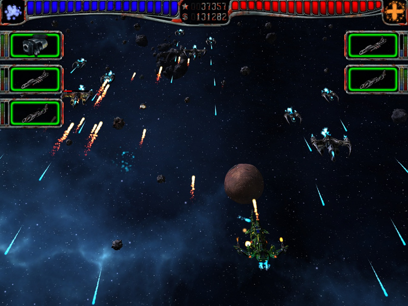

# AstroMenace for Yandex Games

[](https://github.com/kalandos240/astromenace-yandexgames/actions/workflows/build-web-gl4es.yml)

Browser/WebAssembly adaptation of the open-source **AstroMenace** space shooter for **Yandex Games**.

> This repository is a community port. AstroMenace was created by the Viewizard team. The original project is available at [viewizard/astromenace](https://github.com/viewizard/astromenace).

<p align="center">
  
</p>

## Port status

The Yandex Games port now includes:

- C++/SDL2 to WebAssembly compilation with Emscripten;
- browser-safe Emscripten main loop;
- gl4es-based OpenGL 1.x/2.x compatibility on top of WebGL;
- small web-only GLU compatibility helpers for AstroMenace;
- deterministic 1280×720 browser render surface fitted into the Yandex iframe without stretching;
- Yandex Games SDK initialization;
- `LoadingAPI.ready()` integration after the game assets and menu are ready;
- automatic Yandex language detection for the six shipped text translations: English, German, Russian, Polish, Spanish and Turkish;
- the upstream language-table fallbacks for voice and localized bitmap assets that are not available in every language;
- pause/resume handling for platform overlays, ads and page visibility changes;
- local persistent saves with IDBFS;
- Yandex Player cloud-save synchronization plus an immediate save flush after mission completion;
- CSP-safe browser shell with external CSS and no custom inline script/style/event handlers;
- automated GitHub Actions WebAssembly builds;
- runtime TGA/WAV optimization for the Yandex Games package-size limit;
- license, attribution and corresponding-source notices included in the published web artifact.

The current renderer/build diagnostics are written to [`web/BUILD_STATUS_GL4ES.md`](./web/BUILD_STATUS_GL4ES.md) after a CI run. Asset-size analysis is available in [`web/ASSET_SIZE_REPORT.txt`](./web/ASSET_SIZE_REPORT.txt).

## Building the web version

The reproducible WebAssembly build is defined in:

```text
.github/workflows/build-web-gl4es.yml
```

Run **Build AstroMenace WebAssembly (gl4es)** from the repository's GitHub Actions page. A successful run produces the artifact:

```text
astromenace-yandexgames-web-gl4es
```

The artifact contains a Yandex Games web root with `index.html`, external CSS, JavaScript, WebAssembly, packaged game data, source information and license notices. CI publishes the artifact only after the package-size guard and browser-shell audit pass.

The obsolete legacy-GL workflow was removed; gl4es is the single supported browser renderer pipeline for this port.

## Yandex Games integration

The JavaScript bridge is located at:

```text
web/yandex-pre.js
```

The browser shell and stylesheet are located at:

```text
web/shell.html
web/astromenace.css
```

Web-specific C++ behaviour is guarded with `__EMSCRIPTEN__` or applied by the CI-only source preparation script, so the checked-in native AstroMenace source stays close to upstream behaviour.

## Package-size optimization

AstroMenace's native packer converts the upstream game-data sources into a single runtime `gamedata.vfs`. In particular, `gamedata/models/models.pack` must remain available while the VFS is generated because the upstream packer reads model data from it. The raw source tree is not copied separately into the browser distribution: Emscripten preloads only the generated `gamedata.vfs` alongside the WebAssembly/JavaScript shell.

For the temporary browser-build tree, compatible TGA images are converted to AstroMenace's supported lossless RLE representation and PCM WAV files are downsampled for web distribution. The source assets in this repository/upstream project remain unchanged. No gameplay missions, runtime models, textures, sound effects or music tracks are intentionally removed from the packaged game.

## Upstream projects

- Original AstroMenace: [viewizard/astromenace](https://github.com/viewizard/astromenace)
- Emscripten groundwork used during this port: [midzer/astromenace](https://github.com/midzer/astromenace)
- OpenGL compatibility layer used by the browser build: [ptitSeb/gl4es](https://github.com/ptitSeb/gl4es)

## License

AstroMenace source code is distributed under **GNU GPL v3 or later**. Game assets include GPLv3, CC BY-SA 4.0 and SIL OFL 1.1 material as documented by the upstream project.

See [`LICENSE.md`](./LICENSE.md) and the [`licenses/`](./licenses/) directory for the complete notices and license texts. The generated Yandex Games artifact also contains those notices, the gl4es/Emscripten license notices and a `SOURCE_CODE.txt` file pointing to the exact source revision used for the build.

## Credits

AstroMenace copyright © 2006–2019 Mikhail Kurinnoi / Viewizard and contributors.

This repository contains the Yandex Games / WebAssembly adaptation and does not claim ownership of the original AstroMenace project or artwork.
